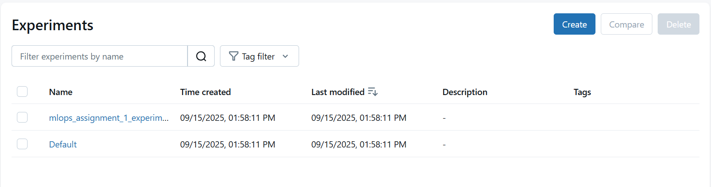

# mlops-assignment-1
This is the final repository for ML-Ops Assignment 1 under supervision of Mr.Asif Ameer done by Ali Nawab 22F-3167 from FAST-NU cfd Campus.

**Problem Statement & Dataset**

**Problem:**  
Our problem was to build and compare 3 different machine learninf models to classify Iris dataset and among them select the best one.Track model metrics,logs using mlflow and register the best model in mlfow.

**Dataset:**  
**Name:** Iris Dataset  
**Source:** `sklearn.datasets.load_iris()`  
**Features:** 4 numerical features (sepal length, sepal width, petal length, petal width)  
**Target:** 3 classes of Iris species (`Setosa`, `Versicolor`, `Virginica`)  

2. Model Selection & Comparison

**Models Used:**  
1. Logistic Regression  
2. Random Forest Classifier  
3. Support Vector Machine (SVM)  

**Training & Evaluation:**  
- Dataset split: 80% train, 20% test  
- Metrics computed: Accuracy, Precision, Recall, F1-score  
- Confusion matrices generated for each model  

**Comparison Results:**  

| Model               | Accuracy | Precision | Recall | F1    |
|--------------------|----------|-----------|--------|-------|
| Logistic Regression | 0.9667   | 0.9697    | 0.9667 | 0.9666|
| Random Forest       | 0.9000   | 0.9024    | 0.9000 | 0.8997|
| SVM                 | 0.9667   | 0.9697    | 0.9667 | 0.9666|

> **Best Model:** Logistic Regression because it gives highest F1 score

 3. MLflow Logging

**Steps Performed:**  
1. MLflow experiment created: `mlops_assignment_1_experiment`  
2. For each model:
   - Logged **hyperparameters**
   - Logged **metrics**: Accuracy, Precision, Recall, F1
   - Logged **artifacts**: Confusion matrix plots and CSV
3. Trained models logged as MLflow artifacts  

**Screenshots:**  

## 4. Model Registration

**Steps Performed:**  
1. Selected **best performing model** based on F1 score  
2. Registered model in **MLflow Model Registry**  
3. Version assigned automatically by MLflow  

**Screenshots:**  
